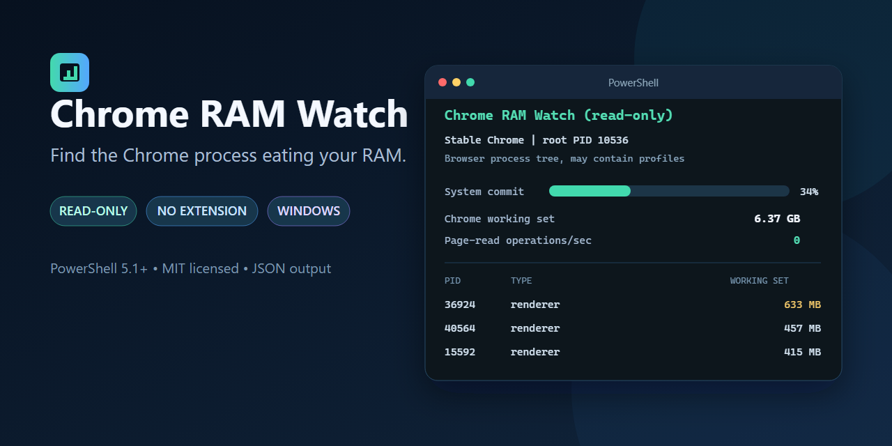

# Chrome RAM Watch




**Diagnose Chrome memory pressure live, then let an opt-in Auto Guard reclaim memory from strictly eligible inactive tabs.**

Chrome RAM Watch has two separate components:

- `Watch-ChromeRam.ps1` is the read-only core. It monitors Windows memory pressure and one or all Chrome browser process trees. It does not require an extension or administrator rights.
- `companion-extension` is an optional cleanup companion. Its disabled-by-default Auto Guard can react to sustained low physical memory, and its separate manual flow can discard only the tabs you review and confirm. Neither mode closes tabs.

The core watcher never closes tabs, ends processes, inspects page contents, changes Chrome settings, writes files, or uses the network.

## What the live watcher shows

- Available physical RAM, available percentage, and system commit pressure
- Normal, Elevated, High, or Critical pressure with explicit thresholds and reasons
- Sustained pressure only after three consecutive successful Elevated-or-worse samples
- Memory paging activity and disk page-read operations as informational context
- Combined totals for one Chrome instance or every Chrome instance in the current Windows session
- Process IDs, root-instance attribution, types, extension markers, memory, CPU, and process age
- Working-set and private-byte changes between comparable samples
- Per-process and total private-memory growth in MB per minute
- Continuous terminal updates, bounded observation with `-SampleCount`, or one-shot JSON
- A manual route from a current renderer PID to its page

## Requirements

### Core watcher

- Windows 10 or Windows 11
- Google Chrome or another Chromium build whose process is named `chrome.exe`
- Windows PowerShell 5.1 or PowerShell 7

No PowerShell module or Chrome extension is required for diagnosis.

### Optional cleanup companion

- Google Chrome 121 or later
- Local unpacked-extension installation

The companion requires only Chrome's non-warning `storage` permission and has no host permissions or content scripts. Storage is used only for local Auto Guard consent, configuration, aggregate state, cooldown, and its bounded sanitized journal; it does not enable Auto Guard. The Manifest V3 service worker stays inert until you enable Auto Guard. That enable gesture requests optional `alarms` and `system.memory` permissions. The separate optional `tabs` permission is requested only if you choose to display titles and URLs in the manual view. Optional permission management is limited to `chrome.permissions.contains()`, `chrome.permissions.request()`, and `chrome.permissions.remove()`.

## Start live diagnosis

Download a release or the repository source, open PowerShell in the extracted folder, and inspect the script before running it:

```powershell
Get-Content .\Watch-ChromeRam.ps1 | more
.\Watch-ChromeRam.ps1
```

The default display refreshes every 10 seconds. Press `Ctrl+C` to stop it.

If Windows marks a downloaded script as blocked, inspect it first, then remove only that downloaded-file marker:

```powershell
Unblock-File .\Watch-ChromeRam.ps1
```

The project does not recommend piping remote code into PowerShell or weakening the machine-wide execution policy.

## Common commands

```powershell
# List selectable Chrome browser instances
.\Watch-ChromeRam.ps1 -ListInstances

# Watch the single standard Chrome instance
.\Watch-ChromeRam.ps1

# Watch every Chrome instance in the current Windows session
.\Watch-ChromeRam.ps1 -AllInstances

# Collect six all-instance samples without clearing earlier output
.\Watch-ChromeRam.ps1 -AllInstances -SampleCount 6 -RefreshSeconds 5 -NoClear

# Watch one explicit browser process tree
.\Watch-ChromeRam.ps1 -BrowserProcessId 10536

# Print one sample and exit
.\Watch-ChromeRam.ps1 -Once

# Produce one machine-readable sample
.\Watch-ChromeRam.ps1 -AllInstances -Once -Json

# Show the 20 largest processes every 15 seconds
.\Watch-ChromeRam.ps1 -AllInstances -Top 20 -RefreshSeconds 15
```

| Parameter | Purpose |
| --- | --- |
| `-BrowserProcessId` | Selects one root Chrome browser PID. It cannot be combined with `-AllInstances`. |
| `-AllInstances` | Combines every Chrome browser process tree in the current Windows session. |
| `-ListInstances` | Lists current root browser PIDs and exits. |
| `-RefreshSeconds` | Sets the interval from 5 to 300 seconds. Default: 10. |
| `-Top` | Sets the number of displayed process rows from 3 to 50. Default: 12. |
| `-Once` | Collects one sample and exits. |
| `-SampleCount` | Attempts a finite number of samples. Zero runs until `Ctrl+C`. Failed attempts count so a bounded run cannot retry forever. |
| `-Json` | Returns one JSON sample and requires `-Once` or `-SampleCount 1`. |
| `-NoClear` | Keeps earlier continuous samples in the terminal. |

## Interpret pressure and growth

The watcher classifies current system pressure from available RAM percentage and committed-memory percentage. It uses the more severe result.

| Level | Available RAM | Commit usage |
| --- | --- | --- |
| Normal | Above 20% | Below 80% |
| Elevated | 20% or less | 80% or more |
| High | 10% or less | 90% or more |
| Critical | 5% or less | 95% or more |

One Elevated-or-worse sample is not labeled sustained. The watcher requires three consecutive successful Elevated-or-worse samples with no unavailable attempt between them. A successful Normal sample or an unavailable attempt resets the streak.

Paging counters are system-wide and can spike briefly for unrelated reasons. The watcher reports them but does not raise the pressure level from a single paging spike.

Growth fields begin with the second comparable sample. Per-process trend identity combines a PID with its process creation time so a reused PID does not inherit the old process's history. Total private-memory growth compares the entire selected Chrome scope, including newly created and exited child processes, only while the exact root creation-identity set remains unchanged.

## Use the optional Auto Guard companion

The companion uses Chrome's supported `chrome.tabs.discard()` API. Discarding unloads page content while keeping the tab visible. Chrome reloads the page when you activate it again.

Install it locally:

1. Open `chrome://extensions` in Chrome.
2. Turn on **Developer mode**.
3. Select **Load unpacked**.
4. Select the included `companion-extension` folder.
5. Open **Chrome RAM Watch: Auto Guard**.

Enable automatic protection:

1. Choose the available-memory trigger and minimum inactive age. The defaults are 15% available physical RAM and four hours inactive.
2. Read and accept the one-time unsaved-work warning.
3. Select **Enable Auto Guard**. Chrome grants the optional local-only `alarms` and `system.memory` capabilities. Required local `storage` remains unable to enable automation by itself.
4. Leave Chrome running normally. Auto Guard checks every two minutes, requires three consecutive valid low-memory samples, and then attempts at most two oldest eligible tabs.
5. After an action cycle, Auto Guard waits at least fifteen minutes before another cycle. Open the popup to see the last physical-memory reading, streak, and bounded local action log.

Auto Guard always skips incognito, highlighted, loading, active, pinned, audible, already-discarded, non-auto-discardable, recent, malformed, and unknown-state tabs. It re-fetches each exact tab ID immediately before discard, confirms the returned ID and discarded state, and stops the cycle on an API or confirmation anomaly. Disable, re-enable, or removal of either automatic optional permission synchronously cancels any pending cycle before it can issue a later discard. Disabling clears the alarm, settings, state, and action log, then removes only `alarms` and `system.memory`. Permission removal also clears old consent, so regranting permission cannot silently resume Auto Guard.

`chrome.system.memory` reports total and available physical memory. It does not identify Chrome as the cause, expose Windows commit pressure, or report per-tab RAM. The PowerShell watcher remains the richer diagnostic layer.

Use the separate manual review flow:

1. Open the popup in the Chrome window you want to review. It scans only that current window. Open it separately in every other Chrome window you want to review.
2. Choose how long a tab must have been inactive.
3. Optional: grant the runtime `tabs` permission to show titles and URLs.
4. Select eligible tabs.
5. Select **Review selected tabs**.
6. Review the exact tab IDs and the unsaved-state warning.
7. Separately select **Discard selected tabs**.
8. Keep the popup open while it rechecks every tab and reports confirmed results.

The manual flow excludes tabs unless Chrome explicitly reports every safety condition:

- inactive;
- unpinned;
- inaudible;
- not already discarded;
- auto-discardable; and
- older than the selected inactivity threshold.

Immediately before each discard request, the companion re-fetches the exact tab ID and applies the same checks again. If an exact ID or protected active, pinned, audible, discarded, auto-discardable, or inactivity state is missing or changed, that tab is skipped. In this documentation, a changed tab means that protected safety state changed. It does not mean that a title or URL changed by itself.

If Chrome allows the extension to run in incognito mode, open the popup separately in each incognito window you want to review. Incognito candidates are explicitly labeled **Incognito** from Chrome's `tab.incognito` value.

The extension cannot detect unfinished forms, drafts, editors, uploads, calls, captures, or other unsaved in-memory page state because it has no host permissions or content scripts. Pin any tab that Auto Guard must never touch, and review every manual selection. The companion never promises a specific amount of recovered RAM. Keep the PowerShell watcher running to observe the actual before-and-after result.

See the companion's [setup and safety guide](companion-extension/README.md) and [security disclosure](companion-extension/SECURITY.md).

## Important scope: browser instance, not Chrome profile

Chrome normally permits one browser process per user-data directory, while regular profiles are subdirectories within that user-data directory. Several profiles can therefore share the same browser process tree.

Chrome RAM Watch can monitor one process tree or all process trees, but it still cannot reliably assign a process to a regular Chrome profile. If it displays a launch profile such as `Profile 35`, treat it only as the profile used to start that browser instance.

Relevant Chromium documentation:

- [Chrome user-data directory structure](https://chromium.googlesource.com/chromium/src/+/main/docs/user_data_dir.md)
- [Chrome ProcessSingleton behavior](https://chromium.googlesource.com/chromium/src/+/main/chrome/browser/process_singleton.h)

## Map a renderer PID to a page

Chrome process IDs change when tabs reload or Chrome restarts. Use a current renderer PID from the watcher.

1. Paste `chrome://process-internals/#web-contents` into Chrome's address bar.
2. Press `Ctrl+F` and search for the PID.
3. Find `Frame[PID:routing_id]` and read the associated site and URL.
4. Save unfinished work before reloading, discarding, or closing that page.

Chromium documents this internal diagnostic view in its [process model documentation](https://chromium.googlesource.com/chromium/src/+/main/docs/process_model_and_site_isolation.md). Its layout can change between Chrome versions.

## Read the measurements

| Measurement | Meaning |
| --- | --- |
| Available RAM | Physical memory Windows can provide immediately. |
| Commit | Memory Windows has promised to processes compared with the commit limit. |
| Summed working set | Sum of resident pages reported for each Chrome process. Shared pages can be counted more than once. |
| Private bytes | Memory allocated privately by the selected Chrome scope. |
| Working-set delta | Change in reported resident pages since the prior comparable sample. |
| Private-byte delta | Change in private allocation since the prior comparable sample. |
| Private growth MB/min | Private-byte delta normalized to one minute. It is not a long-term leak diagnosis by itself. |
| Total private growth MB/min | Change in private bytes for the whole selected Chrome scope, including child-process churn, when the exact root identity set is comparable. |
| Pages/sec | System-wide pages moved to or from disk to resolve memory faults. It is not limited to the pagefile. |
| Page-read operations/sec | System-wide disk read operations used to resolve hard page faults. One operation can read several pages. |
| CPUPercent | Approximate share of total logical-processor capacity since the previous comparable sample. |

See Microsoft's [working-set documentation](https://learn.microsoft.com/en-us/windows/win32/memory/working-set) for the limits of per-process working-set totals.

## JSON output

`-Once -Json` returns schema `chrome-ram-watch/v2`. The scope distinguishes `browser-process-tree` from `all-browser-process-trees` and always discloses `MayIncludeProfiles: true`.

```powershell
$sample = .\Watch-ChromeRam.ps1 -AllInstances -Once -Json | ConvertFrom-Json
$sample.System.PressureLevel
$sample.Scope.RootProcessIds
$sample.Chrome.PrivateBytesGB
$sample.Processes | Sort-Object PrivateBytesMB -Descending | Select-Object -First 10
```

The first sample has no comparable growth interval, so delta and growth fields are null. Use continuous terminal mode to observe live growth.

## Safety and privacy

The core watcher reads:

- Process IDs, parent IDs, creation times, session IDs, executable paths, and Chrome command lines
- Per-process CPU, working-set, and private-memory counters
- Windows physical-memory, commit, and paging counters

Chrome command lines are used only to recognize process type, launch-profile hints, and custom user-data instances. Raw command lines and page URLs are never emitted. `-ListInstances` and JSON instance metadata display the Chrome executable path so multiple channels can be distinguished.

The optional companion reads tab-state metadata through `chrome.tabs.query()` and `chrome.tabs.get()` for eligibility and exact-ID revalidation. Auto Guard also reads aggregate physical-memory capacity through optional `chrome.system.memory.getInfo()`, schedules local checks through optional `chrome.alarms`, and stores only its configuration, aggregate status, exact tab IDs, timestamps, reason codes, and bounded outcomes in required non-warning `chrome.storage.local`. It does not read page contents. Titles and URLs are unavailable unless you separately grant the optional `tabs` permission, and they are never stored or transmitted. It manages optional permissions only through `chrome.permissions.contains()`, `chrome.permissions.request()`, and `chrome.permissions.remove()`.

Neither component makes a network request or sends telemetry. The core never mutates Chrome. The companion's only tab or page-state mutation is `chrome.tabs.discard(tabId)`, either after an explicit manual confirmation or during a currently consented Auto Guard cycle that passes every pressure, cooldown, configuration, and tab-state check.

## Limitations

- Regular profiles can share one browser process tree, so per-profile totals remain unreliable.
- The watcher does not monitor Microsoft Edge, Brave, or processes not named `chrome.exe`.
- Summed working set is approximate, not exact unique physical RAM.
- Pressure levels are conservative threshold labels, not proof that Chrome alone caused system pressure.
- Growth rates describe the interval between two comparable samples, not a confirmed memory leak.
- Renderer PIDs can change at any time.
- An unavailable sample resets sustained-pressure continuity and leaves that interval without a growth comparison.
- The internal PID-to-page view can change between Chrome releases.
- A specifically selected root PID stops safely if Windows reuses that PID for a different process.
- The cleanup companion cannot guarantee preservation of unsaved in-memory page state.
- Chrome decides whether and how much memory a discarded tab releases.
- Auto Guard sees physical available memory, not Windows commit pressure, Chrome-only usage, or per-tab RAM.
- Extension alarms may be delayed after sleep, so a long or invalid sample gap resets sustained-pressure continuity.

## Troubleshooting

**No standard Chrome browser instance was detected**

Run `.\Watch-ChromeRam.ps1 -ListInstances`, then select a listed root with `-BrowserProcessId`, or use `-AllInstances`.

**Multiple standard Chrome browser instances were detected**

Use `-ListInstances` to compare root PID, channel, startup-profile hint, and executable path. Select one PID or use `-AllInstances`.

**CPU and growth values are blank**

Those values need two comparable samples. Wait for the next refresh.

**A bounded sample run exits nonzero**

Unavailable attempts count toward `-SampleCount`. The nonzero result prevents automation from mistaking an incomplete observation for a complete one.

**The script is blocked after download**

Review the source, then run `Unblock-File .\Watch-ChromeRam.ps1`. Do not weaken the machine-wide execution policy for this tool.

## Contributing and security

See [CONTRIBUTING.md](CONTRIBUTING.md) for local checks and pull-request guidance. Report security concerns using [SECURITY.md](SECURITY.md).

Chrome RAM Watch is released under the [MIT License](LICENSE).

Google Chrome is a trademark of Google LLC. Chrome RAM Watch is an independent project and is not affiliated with or endorsed by Google.
